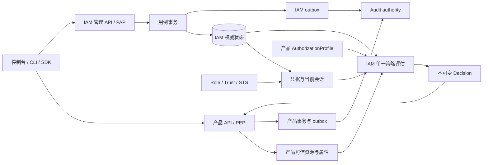

# FEAT-IAM-000：企业访问管理产品契约

- 状态：设计已建立；功能由各子 FEAT 独立实现和验收，整体未验收。
- 分支：`feat/iam`。
- 已推送研究基线：`b0e8627b7e8303136875bda074f2e382c23dfc0b`。
- 领域：IAM。账号、身份、凭据、策略、会话、权限决定归 IAM；业务资源归产品；不可变审计归 Audit；安装与发布准入归 installation。
- 文档边界：本文拥有公共词汇、产品范围和 IAM 内部总体架构；各子 FEAT 拥有具体需求、详细设计、状态和证据。已接受的旧系统行为仍由 [FEAT-006](../docs/features/FEAT-006-platform-authorities.md) 记录。

## 目标

交付可独立私有部署、可供多种业务产品接入的企业访问管理。完成主账号/子用户、组、策略、角色、临时凭据、程序访问、治理和控制台的闭环。账号拥有资源，主体获得访问权，业务服务对真实资源执行权限决定。系统能逐步增加外部身份和组织治理，并保持默认拒绝、租户隔离、撤销生效和可审计性。

本轮允许破坏性替换未发布设计与旧内部实现。风险替换前保留已验证并推送的 Git 回滚点。已经交付的凭据、历史事实、数据库和发布消费者必须明确迁移或拒绝，不把删除权限、回放 bootstrap 或增大版本号当成迁移。

## 对象命名与归属

| 名称 | 中文产品语言 | 归属与含义 | 标识规则 |
| --- | --- | --- | --- |
| `Account` | 账号/租户 | 资源、安全、配额与审计命名空间 | 一个稳定 `accountId`；与现有 `Organization.ID`、业务 `TenantID` 是同一值 |
| `Principal` | 主体 | 可认证或可授权身份的总称 | `principalId` 稳定，类型不能由请求转换 |
| `RootIdentity` | 主账号身份 | Account 指向其原始最终控制主体的关系 | 复用现有 primary USER 的 ID 与凭据谱系；不新增一对一包装主体 |
| `User` | 子用户 | Account 内的长期日常身份，默认无业务权限 | 登录名在 Account 内唯一；显示名可变 |
| `ServiceIdentity` | 服务身份 | 当前有效服务凭据绑定的主体、用途和安装归属 | 保留已发布 ServiceIdentity，不能改写所属账号冒充目标租户 |
| `Group` / `Membership` | 用户组/成员关系 | 组聚合 User；成员关系单独变更和审计 | 同账号多对多；组不能认证 |
| `Role` | 角色 | 允许受信主体承担的虚拟身份 | 独立 `roleId`；无长期密码或访问密钥 |
| `RoleSession` | 角色会话 | 一次角色承担结果 | 保留原始主体、直接承担者、目标角色、过期与撤销状态 |
| `Policy` | 策略 | 稳定元数据容器 | `policyId` 不由名称派生 |
| `PolicyVersion` | 策略内容版本 | 不可变策略文档和摘要 | `versionId` 与语言版本 `languageVersion` 分离 |
| `Statement` | 策略语句 | effect/actions/resources/conditions | 语句 ID 在一个文档内唯一；禁止未知字段 |
| `PolicyAttachment` | 策略关联 | User、Group 或 Role 到 Policy 的授权关系 | 不把主体列表放入权限文档 |
| `TrustPolicy` | 信任策略 | Role 的准入约束 | 只在信任/资源策略里使用 principal |
| `PermissionBoundary` | 权限边界 | User/Role 的权限上限 | 只收窄，不能产生 Allow |
| `SessionPolicy` | 会话限制 | RoleSession 的额外上限 | 不可变，不能扩大角色权限 |
| `Credential` | 凭据 | 密码、访问密钥、认证器材料的总称 | 与 Principal 和 Session 分离；秘密禁止普通 JSON/日志输出 |
| `AccessKey` | 访问密钥 | 长期程序凭据 | 公共 key ID + 仅创建时返回的秘密 |
| `Session` | 登录会话 | 凭据认证后的有期限结果 | credential generation、到期与撤销均为权威状态 |
| `AuthorizationProfile` | 产品授权能力 | 产品拥有的动作、资源、条件与列表语义目录 | product ID + profile revision + content digest |
| `ActionDefinition` | 动作定义 | 产品稳定业务操作 | `<product>.<resource>.<verb>`；没有定义即拒绝 |
| `ResourceReference` | 授权资源 | 产品类型与真实资源 ID | 账号/安装归属由 PEP 与身份验证；不使用创建者 ID 代替所有者 |
| `ConditionKey` | 条件键 | 类型化、可验证来源的属性 | 命名空间、类型、来源、缺失语义明确 |
| `AuthorizationDecision` | 权限决定 | 对一次请求的不可变判断 | decision ID、actor/action/resources、策略和目录版本、理由 |
| `AuditEvent` | 审计事实 | 已发生的认证、权限或业务结果 | source/event ID、scope、digest；不作为在线权限源 |
| `ExternalIdentity` | 外部身份 | 外部 IdP 声明映射 | 延期需求；无环境不启用伪实现 |
| `NotificationContact` | 消息联系人 | 通知目的地 | 不是 Principal，不获得资源权限 |
| `OrganizationGuardrail` | 组织治理上限 | Account 之上的组织策略 | 延期；不与账号内 Role 或 Group 混用 |

`Account` 是对当前 `Organization` 的目标统一命名，不同时保留两个独立归属聚合。改 API 字段、SQL 名称和消费者的准确窗口归 FEAT-IAM-003。现有历史审计的 organization/tenant 字段和 canonical bytes 保持其原始定义。

RootIdentity 表达租户内最终控制权，日常管理员是附加系统管理策略的 User。Root 不能入组、通过普通用户 API 被删除或转让，不能因 root 关系自动获得安装权限。已存在的安装 primary/platform 授权是独立、显式的安装权威；是否在同一主体上存在不改变两种 scope 的判断，迁移不得销毁其封存恢复关系。普通租户管理员不能修改拥有未撤销平台授权主体的密码、状态或平台附件。

STS 固定表示 Security Token Service。服务长期密钥、登录 bearer 和角色临时凭据分别命名，禁止用 `Auth`、`Manager`、`SubAccount` 或一个 `Role` 同时表示多个边界。

## 全量需求分解

“本轮”表示必须实现并通过验收；“延期”仍是产品需求，只有前置条件满足后才开启实现，不能用空页面或 mock 标记完成。

| 需求组 | 完整产品需求 | 本轮范围及 owner |
| --- | --- | --- |
| 产品变更/兼容 | 变更公告、API/语言/profile 版本、升级和回滚边界 | [011](./FEAT-IAM-011-acceptance.md) |
| 账号域 | 开通/列表/详情/暂停/恢复、稳定归属、别名/realm、主账号保护 | [003](./FEAT-IAM-003-account-identities.md) |
| 日常用户 | 独立凭据、创建/查询/停用/恢复/删除、自助资料、管理策略 | [003](./FEAT-IAM-003-account-identities.md) |
| 用户组 | CRUD、成员加入移除、策略关联、直接/继承权限来源 | [004](./FEAT-IAM-004-groups-and-delegation.md) |
| 策略权威 | 系统策略、稳定策略 ID、不可变版本、附件、单一评估器 | [002](./FEAT-IAM-002-policy-authority.md) |
| 高级权限 | 自定义文档、版本切换、Deny、资源匹配、类型条件、边界和委派 | [005](./FEAT-IAM-005-policy-versions-and-boundaries.md) |
| 角色 | 角色 CRUD、信任策略、双边承担、会话时长、撤销、原始身份 | [006](./FEAT-IAM-006-roles-and-sts.md) |
| 程序访问 | 密钥创建/列表/停启/删除/轮换、签名认证、活跃记录、网络限制 | [007](./FEAT-IAM-007-programmatic-credentials.md) |
| 产品能力 | Action/Resource/Condition 注册、版本、粒度、列表和批量契约 | [001](./FEAT-IAM-001-authorization-profile.md) |
| 业务受托 | 服务角色、服务相关角色、用途、同意、工作负载绑定和 PassRole | [008](./FEAT-IAM-008-product-enforcement.md) |
| 属性授权 | 资源/请求标签、来源信任、创建约束、跨资源/分页/批量隔离 | [008](./FEAT-IAM-008-product-enforcement.md) |
| 身份安全 | 密码规则、会话管理、强制改密、MFA/TOTP、登录保护、闲置用户 | [009](./FEAT-IAM-009-security-governance.md)；Passkey 生产 origin/硬件验收延后至前置满足 |
| 治理 | 安全报告、凭据使用记录、权限来源、拒绝诊断、审计检索 | [009](./FEAT-IAM-009-security-governance.md) |
| 控制台/API | 用户、组、策略、角色、密钥、安全设置的可操作流程及严格 API | [010](./FEAT-IAM-010-console.md)；底层契约归相应功能 FEAT |
| 用户/角色 SSO | SAML/OIDC、IdP CRUD、声明映射、登出、Keycloak/ADFS/Okta 等接入 | [012](./FEAT-IAM-012-external-integrations.md)，用户明确允许无环境时延期 |
| 外部人员/生态 | 协作者、跨账号角色、微信/企业微信导入、消息联系人/订阅 | [012](./FEAT-IAM-012-external-integrations.md)，缺可信来源/通道时延期 |
| 组织/云运营 | 组织树/SCP、跨账号资源策略/ACL、计费、配额商业化、多地域复制 | [012](./FEAT-IAM-012-external-integrations.md)，定义需求、启用前置和真实验收 |

购买指南在本产品对应服务容量和运行成本说明；资源支付、结算、实名及账号注销是独立业务，IAM 不假装提供未存在的商业系统。通知联系人可以有完整需求，但无投递通道时不开放假订阅 API。

## 公共不变量

1. Account 拥有应用、配置、数据库、配额、Operation 和审计；创建人停用或删除不会转移、删除或停止资源。
2. 已认证请求的 Account、subject、原始主体与服务用途由当前有效凭据推导；header/body/URL/cursor 不能覆盖。
3. 默认拒绝；匹配 Deny 优先；边界和会话策略只收窄。未知动作、条件、目录版本或不完整权威状态失败关闭。
4. 用户直接附件与组继承可求并集；角色会话只使用角色权限及会话限制，不能把原用户权限再并进角色会话。
5. 新建系统/自定义策略不能隐式获得 platform scope。平台服务凭据的安装归属不等于任意租户访问许可。
6. 每次受保护请求重新检查主体、账号、凭据代际、会话、角色、附件和边界当前状态。MVP 无陈旧授权缓存。
7. 已提交业务任务及历史 outbox 使用发生时的权威证据；撤销影响下一次新请求，不毁掉已提交事实，也不擅自终止既有工作负载。
8. WebSocket/终端必须有有界复核和关闭协议后才声明实时撤权；未交付的主机终端由原产品 owner 实现。
9. 同事务保存安全变更、完成身份和 outbox；授权检查与目标/授权写入锁序一致，防并发重置/授予绕过。
10. bootstrap 等值重放、schema 重放、重启和备份恢复不得恢复已撤销权限、旧 session generation 或已消费离线意图。
11. 租户暂停冻结访问和新变更，历史投递仍可进行。系统 home Account 在当前服务模型下不能在线暂停。
12. 秘密只通过专用一次性响应/私有文件流转；普通 JSON、日志、审计和稳定错误不得包含原始凭据。

## 总体架构

IAM 仍在现有 `app/service/iam` 运行；PAP/PDP/PIP/PEP 是责任名。纯领域规则留在现有 `internal/authority`，用例留在 `internal/usecase/identityaccess`，持久化、HTTP 与生成契约留在现有 owner。确有复杂度边界时才拆子包，不另建一个平行 IAM 服务或通用 receipt 框架。

跨进程契约在 `api/iam`。产品资源事实由相应 PaaS/managedservice/Audit owner 提供；IAM 不跨库查询业务表。PostgreSQL schema/role/连接池隔离、RLS、只授受限函数、实际 runtime 身份探针继续保留。

## 详细设计的公共约定

### 对外接口

目标管理 API 按资源组织：account、users、groups、policies/versions、roles/trust、sessions、access-keys 和 security-settings。tenant management 与 installation platform management 分开。具体路由、字段、状态码和 action 在各子 FEAT 冻结并由原 OpenAPI/schema/example 生成 owner 实现。

`apiVersion` 是 wire 版本，`languageVersion` 是策略语法版本，`versionId` 是策略内容版本，`resourceVersion` 是乐观并发令牌，`profileRevision` 是产品目录版本。数据库 schema 版本和发布 `contractRevision` 又各有独立含义，禁止互相替代。

管理写入需要 request ID、预期资源版本；有一次性创建或需崩溃恢复的操作另有明确 command ID/输入承诺。冲突不产生部分凭据、附件或成功事实。分页使用 opaque、MAC、账号/主体/查询/授权修订绑定的游标，越域返回不泄露存在性的结果。

### 策略计算

策略文档采用 Matrix 自有版本化 JSON。第一版支持明确动作集合、Account 内的精确资源或受限通配、类型化等值/IP/时间条件。每个语句都通过产品目录验证，禁止脚本、任意表达式或客户端自报可信属性。数量、深度、字符串、匹配步数和求值预算有上限。

评估使用当前数据库时间和一次一致权威快照。显式 Deny 在所有相关权限来源和边界中优先；任何必要上限缺少 Allow 都拒绝。RoleSession 不叠加承担者原权限。错误不返回凭据或整个策略；允许的决定记录适用策略/版本/附件和 profile 摘要，拒绝对外只返回安全理由及关联 ID。

### 并发和历史证据

统一锁序从安装/Account scope 到主体，再到策略/角色/凭据/会话/附件。每个跨对象命令在 FEAT 中列出精确顺序。改密保留当前有效 session 的用户选项沿用已接受语义，forced change 必须撤销其他临时 session，缺 generation 的旧会话继续失败关闭。

历史决定和审计事件保持旧编码，不为了新词汇重分类或重写旧哈希。旧 RoleBinding 数据迁移为附件时保存 ID 和撤销时间的证明关系，旧表/函数/API 在切换片删除。历史 evidence 由封闭读取契约验证，不把已撤销附件重新计入权限。

### 发布与集成

本研究基线实际是 IAM4/Audit3/PaaS1 + r4；这不是其他分支的当前 profile。与安装 owner 冻结的最终组合是 IAM6/Audit4/PaaS5 + contractRevision 12；IAM5/r11 不得复用。目录内部等价整理不提前修改 schema/readiness 数字。本分支的中间源码不能把 PaaS1 拼接成一个已验收、可安装的最终产品；最终组装必须采用固定的产品/安装消费者并通过完整 profile 门禁。

每片先聚焦，再真实 PG18 与独立服务进程；里程碑做相关回归。CI 精确 SHA 与本地真实证据各自记录。跨完整 release profile 不匹配仍在副作用前拒绝；SQL 可重放不证明旧 binary 或旧签名包可升级。

## 分解顺序与验收状态

001 动作目录 → 002 单一策略权威 → 003 账号/身份 → 004 组 → 005 自定义策略/边界 → 006 角色/STS → 007 程序凭据 → 008 产品接入/ABAC → 009 治理 → 010 控制台 → 011 整体验收。

每片的 UI 可在对应后端通过后增量交付，安全和历史测试随片实现。012 外部集成保存需求，满足前置后独立启动。整体完成要求所有本轮子 FEAT Accepted，完整需求映射无未归属项，已启用能力有真实运行证据；延期项明确显示 Deferred，不以数量凑齐验收。

## 来源与阅读路线

- 产品语义来源：[纯访问管理产品参考](../doc/access-management/README.md)，固定 `1ad6884ff1f844429b477d5578a039ec809211d7`。
- 公开资料事实与推演边界：[CAM 研究](../doc/access-management/sources/tencent-cam-architecture-analysis.md)，固定 `b0e8627`。
- 采用决定与固定实现：[既有 adoption owner](../docs/adoption/FEAT-006-platform-authorities.md)。
- 跨产品边界：[ADR-0002](../docs/architecture/ADR-0002-product-boundary.md) 和 [依赖规则](../docs/architecture/DEPENDENCY-RULES.md)。

本文与各 FEAT 只陈述 Matrix 目标和行为。供应商特定账号编号、资源字符串、历史协议、品牌生态不成为自研契约。
