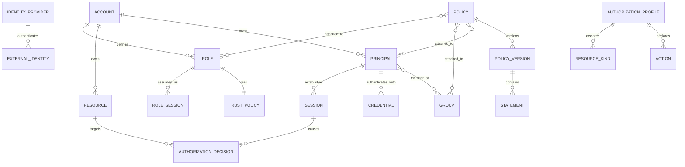

# 领域模型

## 聚合与关系

## 核心对象

### Account

资源所有权、策略管理和账务/治理隔离的顶层边界。账号具有不可复用 ID、显示别名、安全配置和根恢复身份。跨账号访问不会改变资源所属账号。

### Principal

可被认证或可承担角色的主体。主要类型包括账号根身份、本地用户、外部协作者、服务身份和联合外部身份。通知联系人可以与账号关联，但不是可授权主体。

### Credential 与 Session

Credential 证明主体身份，包括密码、MFA 因子、访问密钥或外部令牌。Session 是一次有时限的认证结果，包含主体、原始主体、认证强度、发行与过期时间。凭据与主体分离，使禁用单个密钥不必删除身份。

### Group

用户集合，只用于批量授权和管理。组不可认证，也不直接拥有资源。组成员变化会改变用户的适用策略集合。

### Role

无永久凭据的可承担身份。Role 的 TrustPolicy 决定谁能承担，权限策略决定承担后能做什么。RoleSession 是角色的一次临时实例，并保留实际承担者。

### Policy

策略是有名字的版本容器。PolicyVersion 不可变，由一个或多个 Statement 组成。Statement 使用 effect、action、resource、condition 和在适用策略类型中的 principal 表达授权。

### PermissionBoundary

绑定到用户或角色的最大权限策略。它不授予权限，只与身份/角色策略结果取交集。

### IdentityProvider

外部 SAML 或 OIDC 信任配置，包含发行者、受众、签名密钥、属性映射和允许的联合模式。外部身份通过映射建立用户会话或角色会话。

### AuthorizationProfile

业务产品对 IAM 发布的授权能力契约，包括动作、资源类型、条件键、标签能力、角色能力、授权粒度和列表语义。

### AuthorizationDecision

一次请求的不可变授权证据，包括结果、理由、主体、原始主体、动作、资源、条件摘要、策略版本和产品能力修订。

## 关键不变量

1. 每个资源始终属于一个账号。
2. 主体 ID、角色 ID 和策略版本 ID 删除后不复用。
3. 角色没有密码和永久访问密钥。
4. 策略版本发布后不可修改；变更创建新版本。
5. 没有明确允许即拒绝，明确拒绝优先。
6. 权限边界、会话策略和组织护栏都不能扩大权限。
7. 凭据秘密只在创建或兑换时返回，之后不可查询明文。
8. 产品动作、资源和条件必须先注册再被策略引用。
9. 联合身份的稳定外部标识不能只依赖显示名或邮箱。
10. 每个授权决定可追溯到具体会话、策略版本和产品能力版本。

账号、用户、组、角色、策略、权限与身份提供商共同构成访问管理领域，并通过产品授权能力声明连接业务资源模型。[^1]

## Sources

[^1]: 腾讯云，“[基本概念](https://cloud.tencent.com/document/product/598/54591)”，访问于 2026-09-10。
