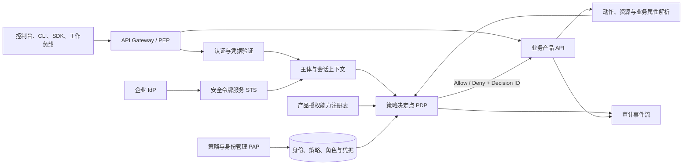
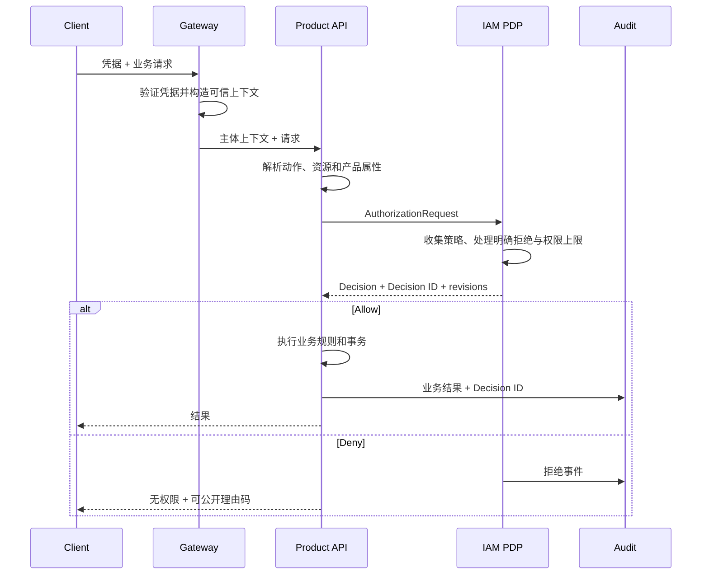

# 技术架构

访问管理采用控制面与请求执行面分离的架构。控制面管理身份、策略、角色、凭据和产品能力；请求执行面在每次业务调用中完成认证、上下文构造、授权求值、执行与审计。

## 架构组件

### 策略管理点（PAP）

PAP 提供用户、组、角色、策略、身份提供商和权限边界的管理 API。写入流程负责 schema 校验、权限校验、策略分析、不可变版本创建和变更审计。PAP 不直接处理业务资源事务。

### 策略决定点（PDP）

PDP 接收可信主体、动作、资源和上下文，收集适用策略并输出允许或拒绝。决定包含稳定理由码与证据修订，供产品执行、故障诊断和审计关联。PDP 不以调用成功替代业务产品的领域校验。

### 策略执行点（PEP）

PEP 位于网关、产品 API 或两者的组合位置。网关验证凭据、移除伪造身份头并建立网络上下文；产品解析真实业务动作和资源。只有产品知道一次请求最终涉及哪些资源，因此资源级授权必须进入产品调用链。

### 策略信息点（PIP）

PIP 提供求值所需的可信属性：用户与会话属性、来源网络、请求时间、资源标签、父子资源关系和业务状态。每个属性都有所有者、类型和新鲜度；客户端自报字段不能直接成为可信授权属性。

### 身份与凭据服务

身份服务管理长期主体和认证因子。凭据验证支持密码、MFA、访问密钥签名和联合令牌。Web 会话与 API 会话统一输出主体、认证强度、所属账号和原始身份。

### 安全令牌服务（STS）

STS 校验角色信任关系后发行短期凭据。角色会话记录承担者、原始主体、会话策略、会话标签、发行与过期时间。角色本身没有永久密码或访问密钥。[^1]

### 产品授权能力注册表

每个业务产品注册稳定产品标识、动作、资源类型、资源层级、条件键、标签能力、授权粒度和列表语义。注册表使策略编辑器、分析器和 PDP 对同一产品词汇达成一致。

### 审计事件流

认证、策略变更、角色承担、授权决定和业务执行分别产生事件，并以决定 ID、会话 ID 和请求 ID 关联。审计存储适合检索与长期留存，但不作为在线授权的数据源。

## 请求执行时序

## 控制面一致性

身份和策略通常跨地域复制并被 PDP 缓存，此类变更可能存在最终一致的传播窗口。[^2] 产品必须为每个决定记录策略与能力修订，并对禁用用户、撤销凭据、明确拒绝等安全收紧提供优先失效通道。控制台应显示变更的期望生效时间，自动化不能假设写 API 返回即代表所有地域已经刷新。

## 高可用与降级

- 认证或 PDP 不可用时，受保护写操作关闭失败。
- 已验证短期令牌可在签名和过期时间有效时本地验证，但仍需执行产品授权策略。
- 策略缓存必须按账号、主体、产品和修订隔离，防止跨租户污染。
- 审计写入采用可靠事件投递；不能通过丢弃拒绝事件保持低延迟。
- 时间同步、密钥轮换、缓存水位和策略传播延迟是核心运行指标。

## Sources

[^1]: 腾讯云，“[角色概述](https://cloud.tencent.com/document/product/598/19420)”，访问于 2026-09-10。
[^2]: 腾讯云，“[产品功能](https://cloud.tencent.com/document/product/598/10586)”，访问于 2026-09-10。
