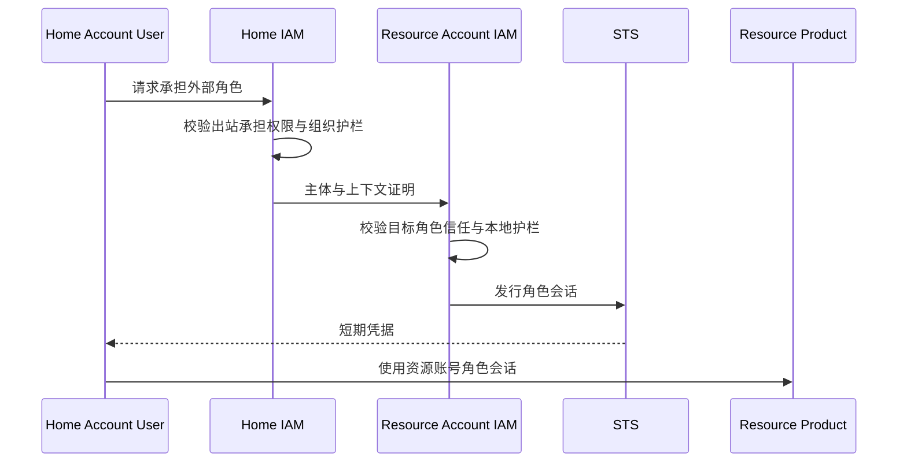

# 多账号权限治理

多账号用于隔离业务、环境、费用、风险或合规边界。治理架构必须把资源所有权、人员身份来源、账号层级和跨账号访问分别建模，避免复制用户和永久密钥。

多账号治理同时处理账号组织、身份复用和资源访问三个问题。[^1]

## 组织模型

- **Organization**：多个账号的治理边界。
- **Organizational Unit**：按部门、环境或风险分组的账号层级。
- **Management Account**：管理组织结构和护栏，不自动读取成员业务数据。
- **Member Account**：拥有自己的资源、角色和资源策略。
- **Identity Center**：集中人员与组来源，向成员账号分配角色。
- **Organization Guardrail**：限制账号可获得的最大权限。

账号层级不等于资源层级；把账号移动到另一个组织单元会改变护栏，但不自动转移资源所有权。

## 跨账号访问

跨账号角色承担需要双边授权：身份所属账号允许主体承担外部角色，资源所属账号的角色信任策略允许该账号/主体，组织护栏均未拒绝。会话在资源账号中获得角色权限，审计同时记录两个账号和原始主体。

## 集中身份

人员在身份中心只有一个生命周期记录，成员账号保存角色分配而非密码副本。登录时选择账号与角色，获得短期会话。人员离职在身份中心禁用后，阻止所有成员账号新会话并撤销高风险活动会话。

## 组织护栏

护栏只定义最大权限，不授予成员账号主体权限。根恢复、安全日志、身份管理和网络边界等关键能力可由组织级明确拒绝保护。多个层级护栏逐层取交集，成员账号管理员不能覆盖上级拒绝。

## 资源策略

对象存储、密钥、消息等产品可以使用资源策略直接授权外部账号或角色。跨账号有效访问通常需要资源侧允许和身份侧允许；产品必须文档化例外与匿名主体语义。

## 集中审计

组织聚合认证、角色承担、授权决定和业务操作事件。每条事件保留资源账号、home account、原始主体、角色会话和目标资源。成员账号不能删除中央副本；中央审计读取本身受独立权限控制。

## 退出与删除

账号退出组织或合作终止时，先阻止新跨账号会话、撤销信任、处理活动会话和资源策略，再移动或关闭账号。历史审计仍保留原组织路径和当时护栏修订。

## Sources

[^1]: 腾讯云，“[企业多账号权限管理概述](https://cloud.tencent.com/document/product/598/74186)”，访问于 2026-09-10。
