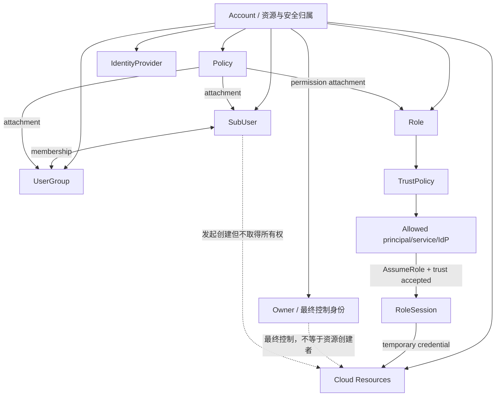
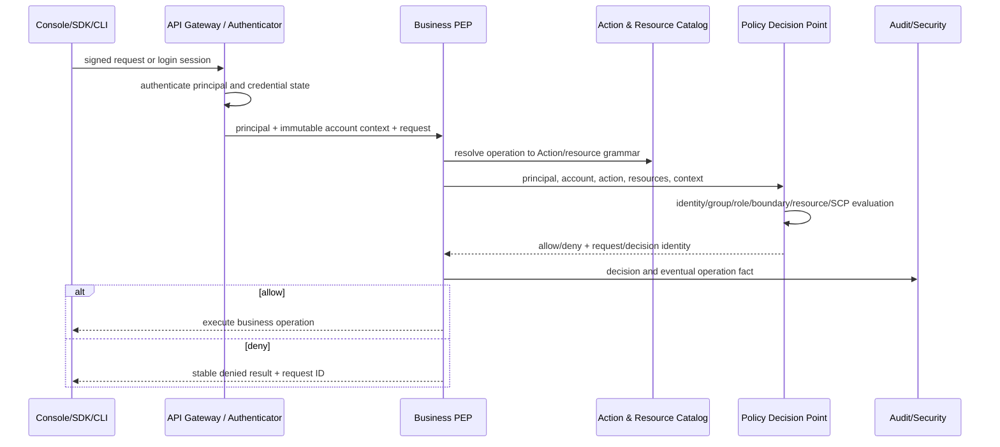
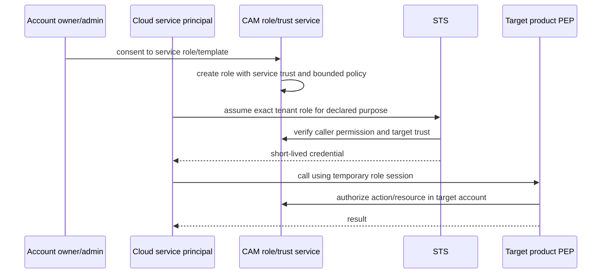
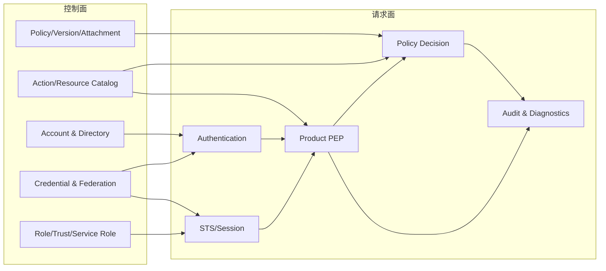

# 腾讯云 CAM 官方资料全量结构与架构推演

> 本文是供应商来源分析，服务于 Matrix 访问管理重构前的命名和边界决策，不是 Matrix 的产品契约。产品文档继续使用自研、供应商中立的语言。完整的 907 个来源节点见[腾讯云访问管理完整来源导航](./tencent-cam-navigation.md)。

## 1. 研究范围、方法与证据口径

| 项目 | 结论 |
| --- | --- |
| 研究日期 | 2026-09-11 |
| 遍历边界 | 严格按左侧导航从“公告”开始，到“词汇表”结束 |
| 目录快照 | 13 个一级节点、202 个目录节点、705 个页面节点，共 907 个唯一节点，最深 5 层 |
| 正文材料 | 官方在线页面、10 份一级栏目的官方合并 PDF，共 3061 页；无合并 PDF 的“购买指南”“联系我们”“词汇表”单独核对 |
| API 材料 | 当前 2019-01-16 API、旧版 2017 API、STS 接口、数据结构、错误码和调用协议 |
| 界面材料 | 官方文档中的用户、角色、访问密钥、权限边界、策略生成器、SSO、安全报告和排障界面截图 |
| 研究产物 | 菜单索引、对象词典、关系模型、API 分类、业务接入模型、界面观察、架构推演和未知项 |

本文对结论使用四种证据标签：

- **官方事实**：官方正文、API 字段或官方合并 PDF 明确写出。
- **界面观察**：官方截图中可直接看到，但文字契约未必完整描述。
- **架构推演**：由多个公开行为、API 和页面模板共同推得，不能冒充腾讯云内部实现声明。
- **尚不可确认**：公开资料不足，必须在 Matrix 设计中自行定义和验证。

研究采用“目录全覆盖、重复页面归类、关键页面逐项深读”的方式。两个大型业务目录共有 368 个产品叶子页，它们大量复用固定模板；本文逐一保留叶子链接，但按模板字段和业务类别归纳，不把相同表格复制数百遍。这样既能证明没有漏菜单，也能形成可使用的架构模型。

## 2. 从“公告”到“词汇表”的总索引

| 顺序 | 一级菜单 | 页面 | 目录 | 在整体架构中的作用 |
| ---: | --- | ---: | ---: | --- |
| 1 | 公告 | 3 | 1 | 契约变更、安全迁移和兼容性边界 |
| 2 | 产品简介 | 7 | 1 | 产品边界、核心对象、用户类型和限制 |
| 3 | 购买指南 | 1 | 0 | IAM 自身与被调用云资源的计费边界 |
| 4 | 快速入门 | 3 | 1 | 官方推荐的最短管理闭环 |
| 5 | 用户指南 | 110 | 25 | 身份、凭据、组、角色、联合、策略和安全生命周期 |
| 6 | 支持角色的业务 | 92 | 59 | 云服务作为调用者时的受托角色注册表 |
| 7 | 支持 CAM 的业务接口 | 276 | 85 | 云服务作为受保护资源时的 Action/Resource 能力注册表 |
| 8 | 实践教程 | 17 | 4 | 多种能力组合后的企业治理模式 |
| 9 | 商用案例 | 33 | 9 | 具体策略表达、资源粒度和边界案例 |
| 10 | API 文档 | 156 | 16 | 公共管理面和 STS 的动作式 RPC 契约 |
| 11 | 常见问题 | 5 | 1 | 文档主线没有完全表达的运行语义和例外 |
| 12 | 联系我们 | 1 | 0 | 人工支持和安全升级边界 |
| 13 | 词汇表 | 1 | 0 | 对外词汇闭包 |
|  | **合计** | **705** | **202** | **907 个来源节点** |

这 13 个菜单不是随意排列。它们从变更通知和产品定义开始，经由默认使用路径进入完整对象生命周期，再分别描述“服务如何代表用户调用”和“服务如何接收鉴权”，随后用实践、案例、API、FAQ 和词汇表收束。由此可把 CAM 公开能力记成五层：

1. **账号与身份层**：主账号、子用户、协作者、消息接收人、用户组、凭据、会话。
2. **委托与联合层**：角色、信任策略、STS、服务角色、SAML/OIDC 身份提供商和 SSO。
3. **授权语言层**：策略、版本、语句、Action、Resource、Condition、标签和权限边界。
4. **业务接入层**：受保护 API 注册表、服务主体注册表、资源描述规则和控制台调用映射。
5. **治理与运维层**：安全报告、审计、排障、变更公告、实践、FAQ 和人工支持。

## 3. 逐菜单分析

### 3.1 公告

该目录包含 API 密钥升级、企业微信关联方式升级、接口授权粒度升级三个页面。它不新增领域对象，却给出三个重要约束：

- SecretKey 从“可再次查询”收紧为“创建时仅展示一次”。这意味着凭据材料与凭据元数据必须分离，读取接口不能返回可逆秘密。
- 企业身份关联可以改变交互和隐私确认流程，但不能暗中改变账号、主体或授权关系。
- API 从粗粒度授权演进到资源级授权时，Action 和资源描述成为兼容契约；业务接入元数据必须可版本化、可审计。
- 策略名称被收紧为不可修改，说明策略的稳定身份不能依赖可变展示名。

对 Matrix 的直接启示是：破坏性重构可以替换尚未发布的模型，但一旦 Action、资源语法、凭据读取语义或稳定标识对外发布，就应按契约迁移处理，不能只改数据库表。

### 3.2 产品简介

七个页面依次回答“是什么、能做什么、用于什么、有哪些概念、有什么限制、有哪些用户、哪些安全能力不属于 CAM”。公开模型的核心结论是：

- 主账号拥有该账号下的资源和费用责任，并默认拥有完整控制能力。
- 子用户、用户组和角色是访问主体或主体集合；它们不是资源所有者。
- 策略表达访问许可，SSO 负责外部身份进入，角色和 STS 负责临时委托。
- CAM 只解决身份与访问控制；网络安全、数据保护、主机安全、业务风控等仍属于其他产品边界。
- “主账号”在文档里同时指账号容器和最终控制身份，公共 API 又把 `Owner` 放进用户类型枚举。这是外部表面的历史融合，不代表 Matrix 内部也应把租户与登录身份做成同一对象。

### 3.3 购买指南

CAM 本身不单独收费；临时凭据或授权主体调用其他云服务产生的费用仍归资源所属主账号。该页面进一步证明：权限主体可以发起资源操作，但资源和费用不会因此转移给主体个人。

### 3.4 快速入门

快速入门只有三步：创建管理员用户、创建普通子账号并授权、子账号登录控制台。它揭示官方推荐的最短闭环：

1. 主账号先建立一个日常管理员子用户。
2. 管理员创建普通子用户，并显式选择访问方式和权限。
3. 子用户使用 `用户名@主账号ID` 或 `用户名@主账号别名` 进入明确账号域。

管理员不是新的用户种类，而是附加了 `AdministratorAccess` 策略的子用户。主账号仍保留最终控制权；日常管理员可替换或撤销，但这不等于把主账号转让给子用户。

### 3.5 用户指南

用户指南是对象生命周期的主要来源。其一级子树和叶子数量如下：

| 子树 | 页面 | 最深子目录 | 核心问题 |
| --- | ---: | --- | --- |
| 概览 | 1 | 无 | 管理入口总览 |
| 用户 | 40 | 主账号、子用户/安全凭证、协作者/安全凭证、消息接收人、用户设置 | 谁能登录、能持有什么凭据、如何停用和删除 |
| 访问密钥 | 5 | 无 | 长期 API 凭据的创建、状态、删除、活跃度和网络限制 |
| 用户组 | 4 | 无 | 成员集合和批量授权 |
| 角色 | 10 | 无 | 信任、临时身份、服务角色、资源绑定和审计 |
| 身份提供商 | 25 | 用户 SSO、角色 SSO | SAML/OIDC 联合与两种 SSO 模式 |
| 策略 | 19 | 相关定义/策略与权限、授权指南、语法逻辑/元素参考/生效条件 | 权限语言、评估和版本 |
| 联合账号 | 3 | 企业微信 | 企业目录关联 |
| 权限边界 | 1 | 无 | 委派管理员的最大权限上限 |
| 排除故障 | 1 | 无 | 从拒绝信息反推缺失许可 |
| 下载安全分析报告 | 1 | 无 | 凭据和身份风险聚合 |

#### 用户与账号域

- **主账号**：资源、费用和最终控制边界。它可以恢复被误撤销管理员权限的子用户，但不应作为日常操作身份。
- **子用户**：主账号域内的独立身份，默认无权限，可拥有控制台凭据、API 密钥、MFA、组成员关系和策略附加关系。
- **协作者**：已有外部主账号以另一个主账号下的协作身份工作，可以切换身份。它表达的是跨账号人员关系，不是第二个本地用户副本。
- **消息接收人**：只接收通知，不获得资源访问能力。它证明“联系人”不应被建模为普通可授权主体。
- **企业微信用户**：来自企业目录的身份来源；公开 API 还出现 `CICUser` 和 `AgentIdentity` 枚举，但官方 CAM 用户指南没有给出可验证的独立生命周期，现阶段只能记为 API 暴露的特殊身份类型，不能推断其完整语义。

同一个 `loginName` 通过主账号 ID 或全局唯一别名解析到账号域。认证后身份已经绑定账号，业务请求不应再通过 caller 提供的账号 selector 切换安全归属。

#### 用户状态、密码与会话

- 子用户停用会关闭控制台登录、API 密钥和消息接收；恢复时各能力需显式重新启用，不应顺手恢复旧会话。
- 密码规则是账号级安全策略，包括复杂度、有效期、历史、失败锁定等约束。
- 登录保护、敏感操作保护、MFA、IP 限制、闲置用户处理和会话时长是不同的控制维度，不能压成一个 `enabled` 布尔值。
- 登录状态同时受空闲超时和绝对最长时长约束；主账号可以令子用户会话全部退出。
- 文档把通行密钥、密码、MFA、访问密钥分开管理。通行密钥属于控制台认证器，不等同于 API AccessKey。
- 删除用户前要处理访问密钥等关联对象；删除和停用语义不同。

#### 访问密钥

访问密钥由公开标识和仅创建时可见的秘密组成。密钥可启用、停用和永久删除，列表只返回元数据，并记录最近使用时间和访问记录。网络限制有账号级和单密钥级两层；文档明确单密钥规则会替代账号规则，而不是与账号规则求交。它是认证前的网络准入，不等于授权策略。

由此应把 `AccessKey`、密钥材料、密钥状态、网络准入规则和使用记录分成不同概念。短期 STS 凭据也不能混入长期 AccessKey 生命周期。

#### 用户组

用户组由主账号拥有，子用户可多对多加入。策略附加到组后由成员继承，查询接口能区分直接附加和随组继承。组只做成员聚合，不应成为可登录主体、资源所有者或角色的别名。

#### 角色

角色是没有长期密码和 AccessKey 的虚拟身份。它至少包含四个相互独立的面：

1. 角色归属账号。
2. 信任策略，即谁可以扮演。
3. 权限策略，即扮演后的临时会话可以做什么。
4. 会话约束，包括最长时长、是否允许控制台访问和外部 ID 等条件。

角色载体可以是同账号或其他账号的主体、云服务、SAML 身份提供商或 OIDC 身份提供商。调用方自身还需要 `AssumeRole` 许可，目标角色的信任策略也必须接受调用方；这是双边准入，不是单边附加一个角色名。

角色目录进一步区分：

- **自定义角色**：租户自行定义信任和权限。
- **服务角色**：云服务预定义用途，经用户同意后代表用户访问资源。
- **服务相关角色**：服务拥有生命周期和固定权限模板，关联资源存在时可能禁止删除。
- **基于资源的服务角色**：角色绑定到具体工作负载或资源，工作负载在运行时获取轮换的短期凭据。

服务角色不能被理解为“平台身份拥有所有租户权限”。服务主体、目标租户、具体角色、信任策略和临时会话必须同时成立。

#### 身份提供商和 SSO

CAM 公开两条不同的联合路径：

- **用户 SSO**：企业 IdP 认证后映射到已经存在的 CAM 子用户命名空间；启用后子用户登录可统一重定向至 IdP。
- **角色 SSO**：企业断言或 OIDC Token 通过 STS 换取角色临时凭据，不要求为每个企业人员同步一个长期 CAM 用户。

SAML 可覆盖控制台和编程访问；公开文档中的 OIDC 角色 SSO 当前主要面向编程访问。IdP 配置、外部身份声明映射、目标角色信任和最终角色权限是四个不同环节。

#### 策略

策略目录把授权拆成策略定义、创建方式、语言、评估、资源、变量、条件、版本和分析器：

- 策略文档是 JSON，包含版本和一个或多个 Statement。
- Statement 使用 `Effect`、`Action`、`Resource`、可选 `Condition`；资源/信任策略还出现 `Principal`。
- 默认拒绝；匹配的显式拒绝优先；至少一个匹配允许才可能通过。
- 资源使用六段式 QCS 名称表达，包含服务、地域、资源所属账号和产品资源路径；历史 `project_id` 段已弱化但仍保留在语法中。
- 条件包含时间、来源 IP、请求标签、资源标签和业务服务自定义条件键。
- 策略变量把请求身份或上下文代入资源和条件，但不会把资源所有权转给创建者。
- 自定义策略支持最多五个版本，并选择一个默认生效版本。附件关系与策略版本是不同对象。
- 系统策略由平台维护，内容可能升级；自定义策略由账号维护。
- 权限边界只限制主体的最大有效权限，不直接授予权限。

公开文档同时记录了一些不一致或例外：部分列表 API、对象存储匿名 ACL、财务权限等场景可能不遵循简单的“显式 Deny 总是覆盖”表述。Matrix 不应复制这种分散例外，而应把异常规则纳入可版本化 Action 目录和可测试的统一评估契约。

#### 排障和安全报告

无权限排障界面会从错误中提取 Service、Action 和 Resource，再进入策略生成器。这说明拒绝结果内部至少保留了规范化鉴权元组和可关联请求 ID。安全报告则把密码轮换、控制台登录、MFA、登录保护、操作保护、AccessKey 风险等聚合，并按用户类型显示 `TRUE`、`FALSE` 或“不适用”。

### 3.6 支持角色的业务

这一目录不是普通用户手册，而是**产品作为调用者**时的注册表。目录按以下业务树展开：

- 计算 → 计算
- 容器与中间件 → 容器、中间件、微服务
- 存储 → 基础存储服务、存储数据服务、数据迁移
- 网络与 CDN → 网络、CDN 与加速
- 数据库 → 关系型数据库、企业级分布式数据库、NoSQL、数据库软硬一体、数据库 SaaS
- 视频服务 → 视频服务、媒体处理、云渲染
- 安全 → 网络安全、应用安全、业务安全、数据安全、安全服务
- 大数据 → 数据分析、数据开发与治理、数据应用与可视化
- 人工智能 → 媒体智能
- 企业应用与云通信 → 云通信、域名与网站、区块链、企业通信、办公协同
- 行业应用 → 教育、游戏、汽车、医疗、科创
- 开发与运维 → 低代码、云资源管理、管理与审计、监控与运维、开发者工具
- 物联网 → 物联平台服务、物联设备服务
- 云平台服务 → 平台服务

每个叶子页采用相同结构：产品名、角色名、角色类型、角色载体、使用场景和由平台维护的权限策略 JSON。由 92 个叶子可以反推出一套稳定的服务接入模型：

1. 产品团队注册一个不可由普通调用方伪造的服务主体。
2. 产品团队提交用途限定的角色模板和所需权限。
3. 用户在明确场景下同意创建或使用该角色。
4. 服务主体按信任关系扮演租户内角色，获取临时凭据。
5. 服务使用临时凭据调用另一个受保护产品。
6. 角色、扮演会话和实际资源调用都可审计。

“服务相关角色”页面还表明删除往往是异步任务，且存在资源依赖检查。这种角色不是普通用户可随意编辑的自定义角色。

### 3.7 支持 CAM 的业务接口

这一目录描述相反方向：**产品作为资源服务**如何接收 CAM 鉴权。目录按以下业务树展开：

- 计算 → 计算、分布式云、高性能计算
- 容器与中间件 → 容器、Serverless、消息队列、微服务工具与平台
- 存储 → 基础存储、存储数据、数据迁移、混合云存储、智能存储
- 网络 → 混合云网络、云上网络
- 数据库 → 关系型数据库、NoSQL、数据库软硬一体、数据库 SaaS、TDSQL
- 视频服务 → 视频服务、视频终端、媒体处理、实时互动、内容创作
- 安全 → 应用安全、业务安全、数据安全、安全服务、安全运营、云安全、内容安全、业务风控、零信任、身份安全
- 大数据 → 数据分析、数据开发与治理、数据应用与可视化
- 云通信与企业服务 → 云通信、域名管理、区块链、网站与备案、资质证照
- 行业应用 → 金融、教育、游戏、汽车、医疗、科创
- 人工智能与机器学习 → AI 应用产品、AI 基础产品、腾讯大模型
- 办公协同 → 办公协同、企业应用、连接器
- 微信生态 → CRM
- CDN 与边缘 → CDN 与边缘平台、边缘计算
- 开发与运维 → 云资源管理、开发者工具、设计协同、监控与运维、管理与审计、API 与工具、云原生应用平台、云迁移工具
- 物联网 → 物联网
- 云平台服务 → 平台服务

每个产品叶子先给出：CAM 产品名、Action 命名空间简称、控制台访问支持、标签授权支持、总体授权粒度和 IP 限制支持；随后按写、读、列表和其他操作列出每个接口的 Action、描述、授权粒度、资源模板和 IP 支持。

公开资料明确区分三种授权粒度：

| 粒度 | 接入含义 | 请求中 Resource 的要求 |
| --- | --- | --- |
| 服务级 | 只能允许或拒绝整个服务 | 使用服务级通配范围 |
| 操作级 | 能区分 Action，不能区分实例 | 必须使用 `*`；错误地传具体资源会拒绝 |
| 资源级 | 同一 Action 可按具体实例授权 | PEP 必须提供真实、规范化的资源标识 |

这套目录实质上是一份公开的 **Authorization Capability Catalog**。业务不能只把任意字符串交给 IAM；它必须预先声明 Action、资源类型和语法、条件键、标签能力、列表语义及控制台所需动作。跨资源操作会列出多个资源模板，说明一次决定可能需要一个动作和一组目标资源，而不是永远只有一个 `resource_id`。

2026-09-10 到 2026-09-11 之间，该目录从 277 个叶子变为 276 个叶子：内容安全相关页面移除 4 个旧节点并新增 3 个节点。这个漂移说明产品接入目录本身必须具有稳定 ID、版本和废弃流程，不能把网页标题当授权契约。

### 3.8 实践教程

17 个页面由安全实践、标签授权、ADFS 用户 SSO、OneLogin 角色 SSO、员工资源隔离、多账号治理、员工操作记录、API 自动化、ABAC 和创建资源时强制标签组成。三个子目录是：

- 员工资源隔离 → 按资源 ID、按标签。
- 企业多账号权限管理 → 集团账号、角色、协作者。
- ABAC → 概述、应用场景。

这些页面证明单一 RBAC 不能覆盖企业目标。真实治理需要：固定资源授权、标签属性授权、跨账号委托、外部身份、自动化账号生命周期、审计和创建时约束的组合。

### 3.9 商用案例

33 个页面按 MySQL、CLB、CMQ、COS、CVM、VPC、云点播和其他案例分类。案例覆盖：

- 全量、只读和特定 Action 权限。
- 精确资源、目录/前缀、地域和标签范围。
- 排除特定操作的显式 Deny。
- 支付权限与资源管理权限分离。
- 跨账号主账号/子账号访问。
- “只能操作自己创建的资源”一类基于策略变量的模式。

“创建者可操作”是策略计算出的许可，不是把资源所有权赋给创建者。资源仍属于主账号。这一点对 Matrix 的租户资源归属尤其重要。

### 3.10 API 文档

当前 API 采用动作式 RPC，而不是 REST 资源路径。公共请求发送到 `cam.tencentcloudapi.com`，使用 `X-TC-Action`、`X-TC-Version: 2019-01-16`、时间戳、临时 Token 和 TC3-HMAC-SHA256 签名；响应统一包在 `Response` 中并带 `RequestId`。

156 个页面的结构如下：

| 分组 | 页面 | 用途 |
| --- | ---: | --- |
| 更新历史、简介、API 概览 | 3 | 生命周期和入口 |
| 调用方式 | 6 | 请求、公共参数、两代签名、响应、类型 |
| 用户相关接口 | 38 | 用户、组、AccessKey、MFA、密码规则、IP、权限边界、账号枚举 |
| 策略相关接口 | 19 | 策略、版本、附件和反向查询 |
| 角色相关接口 | 21 | 角色、信任、会话时长、标签、边界、服务相关角色 |
| 身份提供商相关接口 | 16 | SAML/OIDC、用户 SSO 和角色 SSO 配置 |
| 其他接口 | 1 | 数据流认证 Token |
| 数据结构、错误码 | 2 | 公共类型和失败契约 |
| 访问管理 API 2017 | 50 | 旧协议、角色、STS、策略、组、子用户、IdP |

当前 API 中有 95 个实际管理 Action（38+19+21+16+1）；STS 的 `AssumeRole`、联合临时凭据和 SAML 换取凭据仍主要出现在旧 API 子树。旧树仍在主目录中，表明协议演进和领域生命周期不是同一件事，不能仅凭 URL 版本判断对象已经废弃。

一个典型请求的形状是：

```http
POST / HTTP/1.1
Host: cam.tencentcloudapi.com
Content-Type: application/json
X-TC-Action: ListAccounts
X-TC-Version: 2019-01-16
X-TC-Timestamp: <unix-time>
Authorization: TC3-HMAC-SHA256 ...

{"MaxItems": 100, "Marker": "..."}
```

一个典型响应的形状是：

```json
{
  "Response": {
    "RequestId": "...",
    "Users": [],
    "Marker": "...",
    "IsTruncated": false
  }
}
```

API 暴露的是**管理面和凭据交换面**。公开目录没有通用 `Authorize`/`CheckPermission` 接口，也没有产品 Action 目录的写入接口；这不能证明内部不存在 PDP 或注册接口，只能说明它们不是普通客户的北向 CAM API。

API 数据结构还泄露了若干内部关系：

- `AccessKey` 与 `AccessKeyDetail` 分开，秘密仅在创建结果出现。
- 策略附件使用实体类型区分用户、组和角色，并记录操作主账号、操作子账号、来源类型和时间。
- 查询用户策略时能表达直接附加与随组继承。
- 角色包含角色 ID、名称、信任策略、控制台登录、会话时长、类型、删除任务、标签和 ARN。
- 用户枚举包含 `Owner`、`SubUser`、`CICUser`、`WechatCorpUser`、`AgentIdentity`、`Collaborator`、`MessageReceiver`。其中 CIC 和 AgentIdentity 只确认枚举存在，公开文档没有足够信息定义其完整生命周期。
- 标识体系同时出现 UIN、UID、OwnerUin 和 APPID，属于历史兼容表面，不宜原样复制到新系统。

### 3.11 常见问题

五个页面分别覆盖策略、用户、角色、密钥和其他问题。FAQ 补充的关键运行语义包括：

- 主账号默认不需要额外授权。
- 子用户创建或购买的资源和费用仍属于主账号。
- 子用户自助管理密码、AccessKey 和 MFA 仍需要对应权限。
- AccessKey 删除不可恢复。
- 某些服务角色会在用户授权云服务后出现。
- 系统策略更新可能改变后续有效内容。

FAQ 是重要证据，但也暴露旧项目模型、产品例外等历史语义。Matrix 应将这类规则固化到正式契约和自动化门禁，而不是依赖 FAQ 才能理解。

### 3.12 联系我们

该页面提供销售、工单、移动助手和社区等人工通道。它不新增 IAM 对象，但说明账号恢复、安全事故和无法在线完成的高风险动作需要独立的人工/离线升级路径，不能通过放宽普通管理员权限解决。

### 3.13 词汇表

词汇表以策略、登录凭证、MFA、访问密钥、主账号、身份凭证、权限、用户组、子账号、角色、角色载体、权限策略和信任策略结束整个目录。它确认公开语言中的三个核心区别：

- 身份凭证证明“你是谁”，权限策略决定“你能做什么”。
- 角色载体决定“谁能进入角色”，角色权限决定“进入后能做什么”。
- 主账号是资源所有和最终控制边界；子账号、组和角色是访问管理对象。

## 4. 对象词典、归属和生命周期

| 对象 | 性质 | 谁拥有 | 关键关系 | 生命周期/API 可见性 |
| --- | --- | --- | --- | --- |
| Account / 主账号域 | 资源、费用、安全命名空间 | 云平台登记主体 | 1 个最终控制身份，拥有 IAM 对象和云资源 | 主要通过账号上下文和 Owner 字段暴露 |
| Owner / 主账号身份 | 最终控制身份 | Account | 控制账号恢复和 root-only 动作 | 用户枚举可见；不依赖普通策略获得完整权限 |
| SubUser / 子用户 | 长期人员或自动化主体 | Account | 可入组、附策略、持凭据、登录 | 完整 CRUD、停启、查询 |
| Collaborator / 协作者 | 外部账号在本账号中的协作关系 | 目标 Account | 指向外部身份，可切换身份 | 创建、授权、查询、删除 |
| MessageReceiver / 消息接收人 | 通知目标 | Account | 可入通知组，不访问资源 | 创建、订阅、删除 |
| WechatCorpUser | 企业目录来源的用户 | Account/企业目录关系 | 与企业微信关联 | 列表和导入流程可见 |
| CICUser / AgentIdentity | 特殊用户枚举 | 尚不可确认 | API 仅暴露枚举 | 语义和生命周期未公开，不能自行补全 |
| UserGroup | 主体集合 | Account | 用户多对多加入，策略附加后继承 | CRUD、成员关系、策略附件 |
| Role | 可被扮演的虚拟主体 | Account | 信任策略 + 权限策略 → RoleSession | CRUD、信任、附件、标签、时长 |
| ServiceRole | 服务代表用户调用的角色 | Account，模板由平台产品维护 | 信任指定 ServicePrincipal | 用户授权创建/使用 |
| ServiceLinkedRole | 服务强管理的关联角色 | Account，定义归平台产品 | 与产品资源存在生命周期依赖 | 专门创建、异步删除和状态查询 |
| ResourceBasedServiceRole | 绑定工作负载的服务角色 | Account | Role ↔ Workload/Resource | 控制台绑定，运行时发放临时凭据 |
| IdentityProvider | 外部 SAML/OIDC 信任配置 | Account | 为用户 SSO 或角色 SSO 提供断言 | CRUD 和配置接口 |
| Policy | 稳定策略身份和元数据 | Account 或平台 | 拥有多个 PolicyVersion，附加到实体 | CRUD、列表、反向查询 |
| PolicyVersion | 不可混同于策略身份的文档版本 | Policy | 一个默认版本实际生效 | 新建、删除、设默认、查询；最多五个 |
| Statement | 授权规则 | PolicyVersion | Effect + Action + Resource + Condition | JSON 文档内部对象 |
| TrustPolicy | Role 的资源策略 | Role | Principal/Condition 限定扮演者 | 角色创建和修改接口 |
| PolicyAttachment | Policy 与 User/Group/Role 的关系 | Account | 记录直接/继承及操作来源 | bind/unbind/list |
| PermissionBoundary | 主体最大权限上限 | User 或 Role | 与授予权限求交，不产生许可 | set/get/delete |
| ActionDefinition | 可授权业务动作 | 平台/产品团队 | 属于 ServiceDefinition，声明粒度和资源模板 | 公开为产品能力页；普通客户无写 API |
| ResourceDefinition | 授权资源类型和 QCS 语法 | 产品团队 | Action 引用一个或多个资源类型 | 公开为资源描述模板 |
| ConditionKeyDefinition | 可用上下文属性 | 平台或产品团队 | Statement.Condition 与请求上下文匹配 | 文档/分析器可见 |
| Tag | 资源或角色属性 | Account/资源服务 | 可参与 ABAC 与检索 | 产品支持度不同 |
| Password/Passkey | 控制台登录凭据 | User | 受账号规则、MFA 和保护策略约束 | 设置/重置，秘密不应读取 |
| AccessKey | 长期 API 凭据 | User/Owner | SecretId + 一次性 SecretKey | create/list/update/delete/usage |
| MFAFactor | 第二认证因子 | User | 登录或敏感操作挑战 | 绑定、解绑、验证 |
| LoginSession | 控制台会话 | User | 由长期凭据认证产生 | 时长、全退、状态管理 |
| RoleSession | 短期委托身份 | Role + 原始主体 | 继承角色权限并受会话约束 | STS 返回临时三元组和过期时间 |
| ServicePrincipal | 云产品机器主体 | 平台产品 | 出现在角色信任策略 | 业务角色目录可见，不应由租户随意声明 |
| AuditRecord | 操作和鉴权可追溯事实 | 账号/平台审计域 | 关联 actor、action、resource、request | 角色审计、安全报告、排障侧可见 |

### 4.1 关键归属图



主账号域和主账号身份在腾讯外部语言中被融合，但关系图刻意分开两者：前者是归属容器，后者是最终控制主体。这个分离对 Matrix 的内部模型更安全，也能避免“停用一个用户导致租户资源失去所有者”。

## 5. 策略、信任、边界和临时会话的关系

### 5.1 策略不是角色，角色也不是用户类型

- 管理员是“子用户 + 管理员策略”，不是 `Administrator` 身份种类。
- 组是批量附加策略的成员集合，不是角色。
- 角色是可被扮演的临时身份；信任策略控制入口，权限策略控制出口。
- 权限边界只缩小 User/Role 的最大权限，不赋予任何权限。
- ServicePrincipal 只因某个角色信任它而能扮演该角色，不因“属于平台”而天然访问所有租户。

### 5.2 可公开确认的评估骨架

```text
认证和网络准入失败                         -> 拒绝
没有任何适用 Allow                        -> 默认拒绝
适用策略中命中显式 Deny                   -> 拒绝
身份/组/角色策略允许，且未超过权限边界      -> 可能允许
跨账号资源访问还缺任一侧授权               -> 拒绝
组织 SCP 不允许（相邻产品能力）             -> 拒绝
所有必要边界均允许                          -> 允许
```

这不是腾讯云内部执行顺序的声明。公开资料只能确认这些逻辑边界，不能确认缓存、编译或分布式检查的具体先后。列表过滤、匿名 ACL 和部分财务权限存在公开例外，应作为 Action 目录中的显式语义，而不是散落在业务代码中。

### 5.3 相邻的组织 SCP

CAM 的策略分析器能识别 SCP，但 SCP 文档属于腾讯云组织产品，不在 CAM 左侧目录内。官方相邻文档显示：SCP 附加到组织部门或成员账号并向下继承；有效权限要同时通过从成员到根的 SCP 和账号内 CAM。SCP 是边界而不是授权，服务相关角色还有豁免规则。

因此完整的企业云权限平面不止账号内 IAM：

```text
组织治理边界（SCP） ∩ 账号内身份权限 ∩ 权限边界 ∩ 资源侧许可
```

Matrix 若以后增加组织树，应独立建模组织治理策略，不能把它伪装成普通租户角色。

## 6. 业务如何接入 CAM

### 6.1 产品作为受保护资源：PEP 接入

业务服务必须维护或注册以下元数据：

| 接入元数据 | 用途 |
| --- | --- |
| Service name/short name | 建立 Action 命名空间 |
| Action name | 把业务操作映射为稳定授权动作 |
| Action category | 区分写、读、列表和其他语义 |
| Authorization granularity | 声明服务级、操作级或资源级 |
| Resource type/template | 把真实业务对象规范化为授权资源 |
| Related resources | 表达一次操作依赖的多个资源 |
| Condition keys | 声明可参与判断的请求上下文 |
| Tag support | 声明能否把请求/资源标签送入评估 |
| IP restriction support | 声明该动作是否支持来源网络条件 |
| Console support | 列明控制台路径所需 Action 集合 |

公开目录没有给出内部注册 API，但 276 个一致模板页和策略分析器共同证明这些数据不是运行时自由文本，而是一份平台维护的能力目录。

### 6.2 推演出的受保护请求链



关键安全边界：

- Account/Tenant 必须从当前有效身份和目标资源归属推出，不能相信 caller header、URL、body 或 cursor 改写归属。
- PEP 负责把真实业务对象映射成目录允许的 Action 和 Resource，不能让客户端直接提交一个任意鉴权元组。
- PDP 决定权限，业务服务决定业务载荷真实性和事务结果；二者不能相互冒充。
- 列表和分页必须在授权范围内过滤，cursor 必须绑定查询主体、账号和过滤条件。
- 授权决定和业务事实要有可关联但不同的身份，防止重放或审计错配。

### 6.3 产品作为调用者：服务角色接入



这条链解释了服务身份的三个不同归属：服务主体属于平台产品，角色实例属于目标账号，临时会话代表该角色。任何一个 installation/service 标识都不能单独授予跨租户访问。

### 6.4 控制台如何接入

控制台不是绕过 CAM 的另一套权限系统。产品能力页显式标记“控制台访问”，API Inspector 和排障页面能把控制台步骤还原为 API Action。合理推演是：控制台调用同一业务 API 集合，只可能额外需要列表、元数据或页面初始化 Action；因此控制台和 API 必须共享 Action 目录与 PDP，不能分别维护两套角色判断。

### 6.5 跨账号资源访问

公开案例显示跨账号通常要求资源所属账号在资源策略/信任侧接受对方，同时调用主体所在账号也允许相应 Action。单有一侧许可不能完成访问。这与 AssumeRole 的双边信任结构一致。

## 7. 公共 API 的结构和用途

### 7.1 API 是动作面，不是内部领域模型

腾讯云当前 CAM API 使用稳定 Action 名和类型化请求/响应。它适合 SDK 生成和签名网关，但产生了三个需要注意的现象：

- URL 不表达资源层级，调用语义主要由 Action 和请求体决定。
- 同一领域生命周期散布在多组 Action 中，例如用户、组、密钥和权限边界同属“用户相关接口”。
- 历史 ID 和旧 API 会长期暴露，外部协议不能直接当作干净的内部聚合设计。

### 7.2 API 族及其真正用途

| API 族 | 主要对象 | 真正用途 |
| --- | --- | --- |
| Users/Accounts | User、Group、MFA、PasswordRule、AccessKey、Boundary | 目录、认证器和主体生命周期 |
| Policies | Policy、Version、Attachment | 授权文档和实体关系管理 |
| Roles | Role、TrustPolicy、ServiceLinkedRole、Boundary、Tag | 委托身份和服务接入管理 |
| Identity Providers | SAML/OIDC、UserSSO、RoleSSO | 企业身份联合配置 |
| STS | AssumeRole、FederationToken、SAML exchange | 签发短期会话凭据 |
| Other Token | 数据流认证 Token | 专用协议凭据交换，不能泛化为所有授权 |
| Data Structures/Errors | 公共值对象和稳定错误 | SDK、兼容和排障契约 |

### 7.3 公开 API 没有证明的内容

- PDP 的内部接口和部署形态。
- 产品 Action/Resource/Condition 目录的注册协议。
- 策略编译、索引和缓存失效协议。
- 服务角色模板的内部发布和审批流程。
- 审计写入证明、消息投递和防伪细节。
- 登录认证、root 恢复和高风险人工流程的全部内部接口。

Matrix 不能因为公共 CAM API 未暴露这些能力，就假设腾讯云没有这些组件；也不能凭推演伪造与腾讯内部完全一致的 API。

## 8. 官方界面截图分析

截图只用来识别对象边界和工作流，不把颜色、布局或具体控件当作产品契约。

### 8.1 快速新建用户


界面把用户名、访问方式、用户权限和操作拆成列；`AdministratorAccess` 出现在“用户权限”内，而不是“用户类型”。同时存在首次登录重置密码、登录保护、操作保护和加入用户组等选项。由此可确认用户、凭据、安全策略、权限附件和组成员关系是可独立组合的对象。

### 8.2 代表性截图结论

| 官方页面 | 直接界面观察 | 架构含义 |
| --- | --- | --- |
| [创建管理员用户](https://cloud.tencent.com/document/product/598/47711) | AdministratorAccess 作为策略选择 | 管理员是授权状态，不是身份类型 |
| [新建子用户](https://cloud.tencent.com/document/product/598/13674) | 向导依次选择用户类型、信息、权限、标签、确认；成功页一次性展示凭据 | 主体、凭据、授权和标签应解耦；秘密只在创建结果出现 |
| [创建角色](https://cloud.tencent.com/document/product/598/19381) | 先选腾讯云账号、云服务或 IdP 载体，再配置策略、标签和审阅 | 信任入口先于权限出口；角色不是普通用户 |
| [权限边界](https://cloud.tencent.com/document/product/598/48770) | 先创建策略，再单独绑定为用户边界；可视化生成器含 Effect/Service/Action/Resource/Condition | 边界引用策略文档但拥有不同关系语义 |
| [子账号访问密钥管理](https://cloud.tencent.com/document/product/598/37140) | 状态、创建时间、最近使用、删除和访问记录分别呈现 | 凭据生命周期与审计使用事实分离 |
| [用户 SSO 概述](https://cloud.tencent.com/document/product/598/61673) | SAML/OIDC 配置、元数据、IdP URL、Client ID、回调地址分开 | 协议配置和用户映射属于联合身份子域 |
| [角色 SSO 概述](https://cloud.tencent.com/document/product/598/30284) | 断言/Token 经 STS 换取临时身份 | 联合认证结果不是长期本地用户凭据 |
| [通过策略生成器创建自定义策略](https://cloud.tencent.com/document/product/598/37739) | 可视化和 JSON 两种入口 | UI 只是策略语言编辑器，最终契约是文档 |
| [如何根据无权限信息创建权限策略](https://cloud.tencent.com/document/product/598/38350) | 拒绝详情可带入 Service/Action/Resource | 决定结果应携带规范化、可排障的元数据 |
| [下载安全分析报告](https://cloud.tencent.com/document/product/598/65676) | 不同身份类型的安全项显示 TRUE/FALSE/不适用 | 安全能力矩阵不能用单一布尔字段表达 |

## 9. 从公开资料推演出的 CAM 组件架构

以下组件名称是架构推演，不是腾讯云官方内部服务名。

| 推演组件 | 公开证据 | 责任边界 |
| --- | --- | --- |
| Account Registry | 主账号、别名、UIN/UID/APPID、realm 登录 | 账号域、资源和费用归属、root 控制 |
| Identity Directory | 用户、协作者、联系人、组和查询 API | 主体与成员关系，不管理业务资源 |
| Credential Service | 密码、Passkey、MFA、AccessKey、登录保护 | 认证器状态、代际、轮换和撤销 |
| Session Service | 登录状态、全退、STS 过期 | 长期身份到短期会话的转换 |
| Federation Service | SAML/OIDC、用户 SSO、角色 SSO | 外部身份验证与本地主体/角色映射 |
| Policy Administration | 策略、版本、附件、边界 API | 授权文档和关系的控制面事务 |
| Authorization Catalog | 276 个产品能力页、策略分析器 | Service/Action/Resource/Condition/Tag 元数据 |
| Policy Compiler/Indexer | 版本切换、分析器、规模化产品接入 | 校验并准备可高效评估的策略表示 |
| PDP | 默认拒绝、Deny/Allow、边界、跨账号规则 | 对规范化请求做纯授权决定 |
| Product PEP | 每个业务 API 的粒度和资源模板 | 绑定真实业务请求、Action、资源和上下文 |
| Role/Trust Service | 角色、信任策略、会话时长 | 双边扮演准入和角色生命周期 |
| STS | 三种临时凭据接口 | 发放短期凭据，不保存长期用户秘密 |
| Service Role Broker | 92 个服务角色产品页 | 产品主体、模板、租户角色和同意流程 |
| Audit/Troubleshooting | 角色审计、操作记录、安全报告、拒绝向导 | 决定、会话和业务事实的关联与诊断 |
| Propagation Plane | 策略更新、密钥状态、网络限制传播说明 | 变更分发、缓存失效和失败关闭 |

### 9.1 控制面与请求面



### 9.2 为什么业务接入目录是架构核心

如果只有用户、角色和策略表，没有 Action/Resource Catalog 与各产品 PEP，策略无法安全落到真实资源。反过来，如果业务自己解释角色名，IAM 就无法提供统一拒绝、边界、临时会话、跨账号和排障。因此 CAM 的运行原理应理解为：

```text
稳定身份 + 可版本化策略语言 + 产品能力目录 + 业务 PEP + 集中/一致 PDP + 可关联审计
```

而不是“查一下用户有没有某个字符串角色”。

## 10. 来源漂移、矛盾和隐藏线索

| 现象 | 可确认事实 | 应如何处理 |
| --- | --- | --- |
| 导航 706 → 705 页面 | 2026-09-10 快照为 706；2026-09-11 实时为 705，内容安全节点发生替换 | 保存稳定来源 ID 和抓取日期，不把标题当主键 |
| CAM 业务接口 PDF 章节数多于实时叶子 | PDF 中检测到 283 个带更新时间的章节，导航为 276 个叶子 | 视为合并 PDF 残留/生成差异，不称其为 283 个当前产品 |
| API PDF 章节数多于导航 | PDF 中检测到 158 个带更新时间的章节，导航为 156 个叶子 | 可能含生成元页或历史页，正式覆盖按实时导航计数 |
| 策略版本冲突 | 元素参考仍称 2.0；策略分析器公开支持 2.0/3.0，并链接未出现在左侧树的 3.0 指南 | 记为公开资料不一致，不替用户冻结语法版本 |
| CICUser/AgentIdentity | `ListAccounts` 和数据结构有枚举，用户指南无完整定义 | 只保留“特殊身份种类存在”，不推断生命周期 |
| QCS project 段 | 六段式语法保留 project，但新实践主要依赖账号、资源 ID、地域和标签 | Matrix 不复制废弃字段；资源语法需从当前业务模型重新定义 |
| Deny 存在例外页 | 总体评估文档与部分服务/列表/财务例外并存 | 例外必须进入明确版本化语义和测试，不接受隐藏代码分支 |
| 当前与 2017 API 并列 | 新旧协议都在目录内 | API 协议版本和领域模型版本必须分开管理 |

## 11. Matrix 命名候选，等待产品定义

以下只是从 CAM 对象关系抽象出的候选词，不是已经冻结的 Matrix 名称，也不要求复制腾讯云的 UIN、QCS 或 RPC 表面。

| CAM 公开概念 | Matrix 候选名称 | 推荐边界 | 不建议的混淆 |
| --- | --- | --- | --- |
| 主账号域 | `Tenant` 或 `TenantAccount` | 资源、安全、审计和费用归属 | 与某个可停用 User 做成同一行 |
| 主账号身份 | `RootIdentity` 或 `AccountOwner` | 每租户唯一最终控制身份，不转让给普通子用户 | 叫普通 `Administrator`，或获得平台运营权限 |
| 子用户 | `User` | 租户内长期人员/自动化身份，默认无权限 | `SubTenant`、资源 Owner |
| 协作者 | `ExternalMember` | 指向外部身份的租户成员关系 | 复制出第二套本地密码身份 |
| 消息接收人 | `NotificationContact` | 只接收通知，不参与资源授权 | `User` 的弱化状态 |
| 用户组 | `Group` | 用户集合和批量策略附件 | `Role` |
| 角色 | `Role` | 信任策略可进入的虚拟主体 | 固定权限字符串或用户类型 |
| 角色载体 | `TrustedPrincipal` | User/Role/Service/IdP 等信任来源 | 角色权限本身 |
| 权限策略 | `Policy` + `PolicyVersion` | 稳定身份与不可变版本分开 | 可变名称作为唯一身份 |
| 策略绑定 | `PolicyAttachment` | User/Group/Role 与 Policy 的关系 | 把附件复制进策略 JSON |
| 权限边界 | `PermissionBoundary` | 最大权限上限，不授予权限 | Deny 策略别名 |
| 长期 API 密钥 | `AccessKey` | 属于长期 Principal，秘密只显示一次 | STS 会话或服务身份 |
| 临时身份 | `RoleSession` / `SessionCredential` | 有来源主体、角色、代际、到期和会话策略 | 永久 User |
| 云服务主体 | `ServicePrincipal` | 平台注册且用途限定 | `PLATFORM_OPERATOR` 或全租户通行证 |
| 服务角色模板 | `ServiceRoleTemplate` | 产品拥有模板，租户实例化角色 | 普通租户任意创建的 service name |
| 工作负载角色绑定 | `WorkloadRoleBinding` | 具体资源到角色的绑定 | 安装归属或服务主体归属 |
| 可授权动作 | `ActionDefinition` | 稳定、版本化的业务动作 | handler 名称或任意字符串 |
| 授权资源 | `ResourceReference` | 类型 + 稳定 ID + 所属 Tenant | 创建者 UserID |
| 条件目录 | `ConditionKeyDefinition` | 平台/产品注册的类型化上下文 | 任意 attributes map |
| 鉴权输入 | `AuthorizationRequest` | 当前有效主体、Tenant、Action、Resources、Context | caller 自选 Tenant 或已决定结果 |
| 鉴权输出 | `AuthorizationDecision` | allow/deny、规则来源、决定 ID、可审计原因 | 可缓存的永久 permit |

### 11.1 建议优先由产品负责人冻结的五个问题

1. 对外叫“账号”还是“租户”；内部是否明确拆成 `Tenant` 和唯一 `RootIdentity`。
2. 协作者是否进入第一版，还是先只支持本租户 `User`。
3. 第一版策略语言是否只支持固定 Action/Resource/Condition 子集，还是直接承诺完整 JSON 策略。
4. 角色第一版是否同时支持人员角色、服务角色和工作负载角色，还是按切片逐步开放。
5. 业务接入目录由谁拥有，Action 和资源类型如何版本化，PEP 以库、sidecar、gateway 还是内部 API 接入。

### 11.2 可供讨论的 API 分层，不是冻结路由

```text
租户 IAM 管理面
  /v1/iam/users
  /v1/iam/groups
  /v1/iam/policies
  /v1/iam/roles
  /v1/iam/identity-providers

临时凭据面
  /v1/sts/role-sessions

平台租户生命周期面
  /v1/platform/tenants/{tenantId}

内部业务鉴权面
  /v1/internal/authorization:check

内部产品接入面
  /v1/internal/authorization-catalog/services/{service}/...
```

租户 IAM 路由中的 Tenant 应由认证身份确定；只有明确的平台租户生命周期接口才能以目标 Tenant 作为资源参数。业务鉴权面应只接受经过服务认证且由 PEP 规范化的请求，不成为普通用户构造任意 Action/Tenant/Resource 的权限探测接口。

## 12. 破坏性演进到同等级架构的建议顺序

本研究支持破坏性替换，但应按可验收纵向切片推进：

1. **冻结词汇和归属**：先确定 Tenant、RootIdentity、User、Group、Role、Policy、ServicePrincipal 和 ResourceReference，不保留旧名兼容壳。
2. **建立授权能力目录和 PEP 契约**：先让一个真实 PaaS 资源使用类型化 Action/Resource 完成跨租户攻击门禁。
3. **替换策略核心**：Policy/Version/Statement/Attachment、默认拒绝、显式 Deny、组继承和权限边界一起形成最小闭环。
4. **拆分身份与凭据**：密码、Passkey/MFA、AccessKey、会话、credential generation 和停用级联各自有状态机。
5. **建立 Role/Trust/STS**：完成双边 AssumeRole、短期凭据、会话撤销和审计，再接服务角色。
6. **接入第二类服务**：同时验证产品作为 PEP 和产品作为服务主体，证明平台身份不等于跨租户通行。
7. **联合身份和 ABAC**：SAML/OIDC、标签、条件键、创建时标签约束按实际企业场景加入。
8. **组织治理边界**：最后引入组织树/SCP 类上限，不把它混进租户内 Policy。

每片都应验证当前行为、权限不变量、真实数据库隔离、进程身份、审计关联、重启和升级保留；不能只测试策略 JSON 或 SQL 文本。

## 13. 公开资料无法确认的内部实现

以下内容不能从左侧菜单、API 或截图可靠推出：

- CAM 内部数据库模型、分库分片方式和事务边界。
- PDP 是集中服务、边车、网关插件还是混合部署。
- 策略编译格式、索引结构和热点缓存布局。
- 用户、策略、角色或密钥变更的精确缓存失效协议与全地域一致性时限。
- 内部鉴权 API、服务到服务认证和 Action 注册审批协议。
- STS 和登录 Token 的内部密码学封装、密钥托管和轮换实现。
- 审计链、防伪证明、消息投递和重放去重的内部细节。
- `CICUser`、`AgentIdentity` 的完整创建、凭据、权限和删除语义。
- root 恢复、申诉、企业认证和高风险人工操作的全部后台流程。

Matrix 必须把这些内容作为自研架构决策，并用自己的威胁模型和验收门禁证明，不能写成“腾讯云就是这样实现的”。

## 14. 主要官方来源

### 目录和总览

- [访问管理完整文档](https://cloud.tencent.com/document/product/598)
- [CAM 概述](https://cloud.tencent.com/document/product/598/10583)
- [基本概念](https://cloud.tencent.com/document/product/598/54591)
- [用户类型](https://cloud.tencent.com/document/product/598/13665)
- [主账号相关](https://cloud.tencent.com/document/product/598/41656)
- [词汇表](https://cloud.tencent.com/document/product/598/18564)

### 身份、凭据和会话

- [创建管理员用户](https://cloud.tencent.com/document/product/598/47711)
- [新建子用户](https://cloud.tencent.com/document/product/598/13674)
- [子账号登录控制台](https://cloud.tencent.com/document/product/598/48026)
- [禁用子用户](https://cloud.tencent.com/document/product/598/108522)
- [为子用户重置登录密码或管理通行密钥](https://cloud.tencent.com/document/product/598/36260)
- [子账号访问密钥管理](https://cloud.tencent.com/document/product/598/37140)
- [登录状态管理](https://cloud.tencent.com/document/product/598/56220)

### 角色、策略和联合身份

- [角色概述](https://cloud.tencent.com/document/product/598/19420)
- [角色基本概念](https://cloud.tencent.com/document/product/598/19421)
- [创建角色](https://cloud.tencent.com/document/product/598/19381)
- [基于资源的服务角色](https://cloud.tencent.com/document/product/598/85616)
- [策略与权限概述](https://cloud.tencent.com/document/product/598/38503)
- [策略语法](https://cloud.tencent.com/document/product/598/10604)
- [策略评估逻辑](https://cloud.tencent.com/document/product/598/10605)
- [资源描述方式](https://cloud.tencent.com/document/product/598/10606)
- [策略版本控制](https://cloud.tencent.com/document/product/598/37301)
- [权限边界](https://cloud.tencent.com/document/product/598/48770)
- [策略分析器](https://cloud.tencent.com/document/product/598/107704)
- [SSO 概览](https://cloud.tencent.com/document/product/598/96014)

### 业务接入和 API

- [支持角色的业务](https://cloud.tencent.com/document/product/598/85165)
- [支持 CAM 的业务接口](https://cloud.tencent.com/document/product/598/67350)
- [API 简介](https://cloud.tencent.com/document/product/598/43337)
- [API 概览](https://cloud.tencent.com/document/product/598/33155)
- [请求结构](https://cloud.tencent.com/document/product/598/33157)
- [签名方法 v3](https://cloud.tencent.com/document/product/598/38504)
- [数据结构](https://cloud.tencent.com/document/product/598/33167)
- [访问管理 API 2017 与 STS](https://cloud.tencent.com/document/product/598/13876)
- [腾讯云组织 SCP（相邻产品）](https://cloud.tencent.com/document/product/850/83574)
